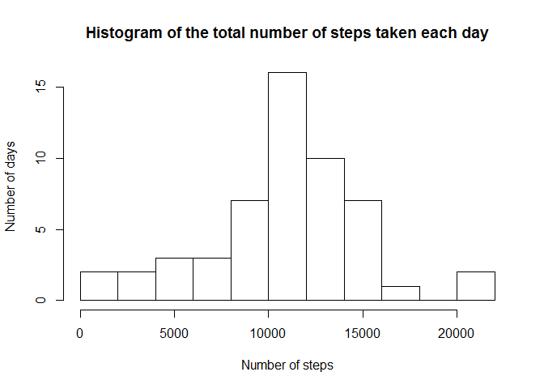
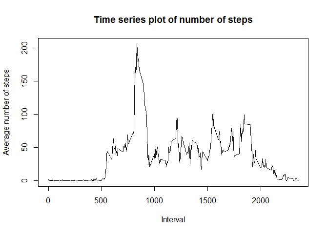
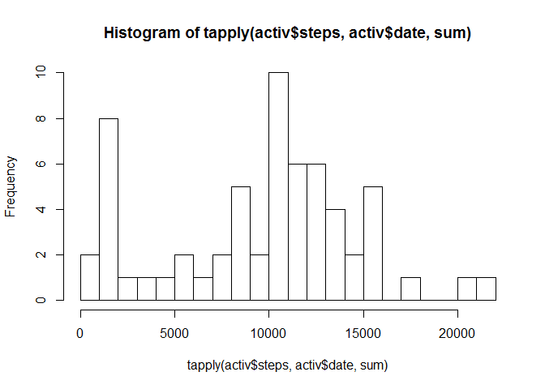
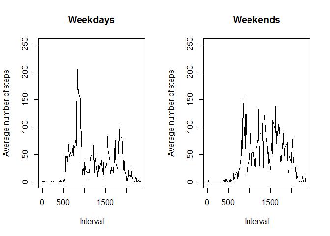

# Reproducible Research: Peer Assessment 1 - Chetan Shenoy


## Loading and preprocessing the data


```r
activ <- read.csv('activity.csv')

dailyactiv <- tapply(activ$steps, activ$date, sum)
hist(dailyactiv, xlab = "Number of steps", ylab = "Number of days", main = "Histogram of the total number of steps taken each day", breaks = 10)
```

<!-- -->


## What is mean total number of steps taken per day?


```r
print(paste0("The mean number of steps taken each day is ", mean(dailyactiv, na.rm = TRUE)))
```

```
## [1] "The mean number of steps taken each day is 10766.1886792453"
```

```r
print(paste0("The median number of steps taken each day is ", median(dailyactiv, na.rm = TRUE)))
```

```
## [1] "The median number of steps taken each day is 10765"
```


## What is the average daily activity pattern?


```r
x <- tapply(activ$steps, activ$interval, mean, na.rm = TRUE)
plot(x ~ names(x), type = "l", xlab = "Interval", ylab = "Average number of steps", main = "Time series plot of number of steps")
```

<!-- -->

```r
names(which.max(x))
```

```
## [1] "835"
```


## Imputing missing values

I am going to fill the missing data with the median of the value for that 5-minute interval.


```r
for (i in seq(0, 2355, 5)){
  activ[activ$interval == i,]$steps <- replace(activ[activ$interval == i,]$steps, which(is.na(activ[activ$interval == i,]$steps)), median(activ[activ$interval == i,]$steps, na.rm = TRUE))
}

hist(tapply(activ$steps, activ$date, sum), breaks = 20)
```

<!-- -->


## Are there differences in activity patterns between weekdays and weekends?


```r
activ$date <- as.Date.factor(activ$date)
activ <- cbind(activ, day = weekdays(activ$date))

mondayactiv <- subset(activ, activ$day == "Monday")
tuesdayactiv <- subset(activ, activ$day == "Tuesday")
wednesdayactiv <- subset(activ, activ$day == "Wednesday")
thursdayactiv <- subset(activ, activ$day == "Thursday")
fridayactiv <- subset(activ, activ$day == "Friday")
saturdayactiv <- subset(activ, activ$day == "Saturday")
sundayactiv <- subset(activ, activ$day == "Sunday")

weekdayactiv <- rbind(mondayactiv, tuesdayactiv, wednesdayactiv, thursdayactiv, fridayactiv)
weekendactiv <- rbind(saturdayactiv, sundayactiv)

a <- tapply(weekdayactiv$steps, weekdayactiv$interval, mean)
b <- tapply(weekendactiv$steps, weekendactiv$interval, mean)

par(mfrow = c(1, 2))

plot(a ~ names(a), type = "l", xlab = "Interval", ylab = "Average number of steps", main = "Weekdays", ylim = c(0,250))
plot(b ~ names(b), type = "l", xlab = "Interval", ylab = "Average number of steps", main = "Weekends", ylim = c(0,250))
```

<!-- -->

